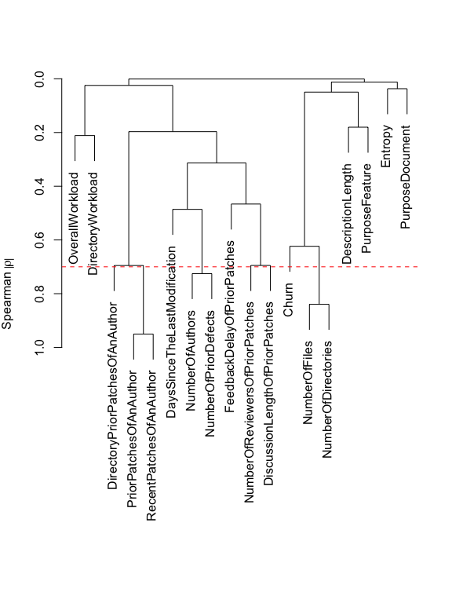
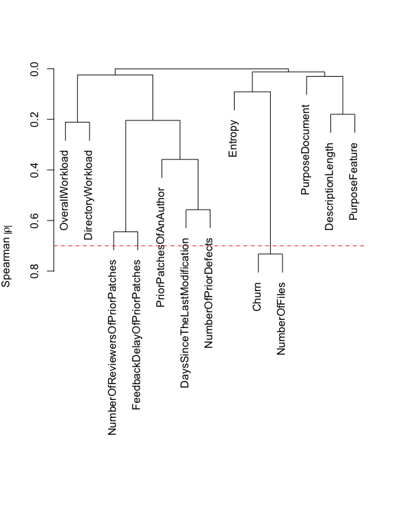
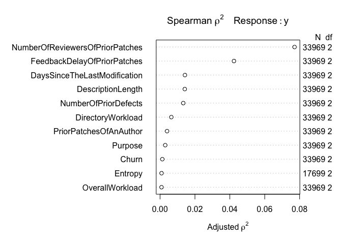
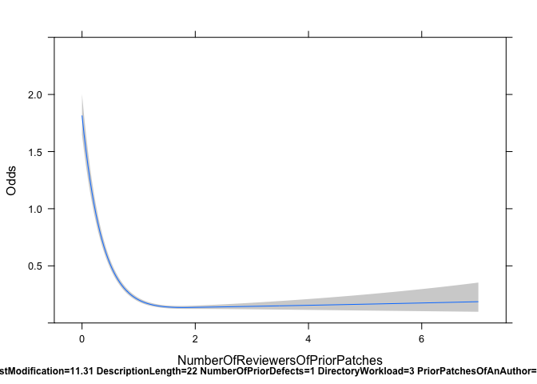

# Replication Package for "Review Participation in Modern Code Review – An Empirical Study of the Android, Qt, and OpenStack projects"

Patanamon Thongtanunam, Shane McIntosh, Ahmed E. Hassan, and Hajimu Iida  
[Empirical Software Engineering Journal, vol. 22, issue 2, 2017](https://doi.org/10.1007/s10664-016-9452-6)

## 1) Bibtex

```bibtex
@article{Thongtanunam2017,
 author = {Thongtanunam, Patanamon and Mcintosh, Shane and Hassan, Ahmed E. and Iida, Hajimu},
 title = {Review Participation in Modern Code Review},
 journal = {Empirical Software Engineering},
 issue_date = {April 2017},
 volume = {22},
 number = {2},
 month = apr,
 year = {2017},
 issn = {1382-3256},
 pages = {768--817},
 numpages = {50},
 url = {https://doi.org/10.1007/s10664-016-9452-6},
 doi = {10.1007/s10664-016-9452-6},
 acmid = {3086306},
 publisher = {Kluwer Academic Publishers},
 address = {Hingham, MA, USA},
 keywords = {Code review, Developer involvement, Review participation},
} 
```

## 2) Download Processed Datasets

Each dataset contains the 20 patch and MCR metrics for the studied patches. Each row also includes review ID, number of reviewers, discussion length, date of last update before feedback, and date of the first feedback of a patch.

- Android dataset (csv file, ~11 MB)
- Qt dataset (csv file, ~23 MB)
- OpenStack dataset (csv file, ~33 MB)

You can download these datasets [here](https://github.com/SAILResearch/replication-participation_code_review/releases/latest)

## 3) Additional Results

### 3.1) RQ1 Results

Analysis                                   | Android                                                                                         | QT                                                                                         | OpenStack
-------------------------------------------|-------------------------------------------------------------------------------------------------|--------------------------------------------------------------------------------------------|--------------------
Model Construction                         | [Variable Clustering](figures/varclus/varclus_NumberOfReviewers_AndroidReviews.pdf)             | [Variable Clustering](figures/varclus/varclus_NumberOfReviewers_QtReviews.pdf)             | [Variable Clustering](figures/varclus/varclus_NumberOfReviewers_OpenStackReviews.pdf)  
"                                          | [Spearman multiple rho^2](figures/spearman/estimateDF_NumberOfReviewers_AndroidReviews.pdf)     | [Spearman multiple rho^2](figures/spearman/estimateDF_NumberOfReviewers_QtReviews.pdf)     | [Spearman multiple rho^2](figures/spearman/estimateDF_NumberOfReviewers_OpenStackReviews.pdf)
Nonlinear relationship with the likelihood | [#Reviewers of prior patches](figures/rq1/results_NumberOfReviewers_Android_PriorReviewers.pdf) | [#Reviewers of prior patches](figures/rq1/results_NumberOfReviewers_Qt_PriorReviewers.pdf) | [#Reviewers of prior patches](figures/rq1/results_NumberOfReviewers_OpenStack_PriorReviewers.pdf)
"                                          | -                                                                                               | [Description length](figures/rq1/results_NumberOfReviewers_Qt_DescriptionLength.pdf)       | - 

### 3.2) RQ2 Results

Analysis                                   | Android                                                                                                      | QT                                                                                                      | OpenStack
-------------------------------------------|--------------------------------------------------------------------------------------------------------------|---------------------------------------------------------------------------------------------------------|--------------------
Model Construction                         | [Variable Clustering](figures/varclus/varclus_DiscussionLength_AndroidReviews.pdf)                           | [Variable Clustering](figures/varclus/varclus_DiscussionLength_QtReviews.pdf)                           | [Variable Clustering](figures/varclus/varclus_DiscussionLength_OpenStackReviews.pdf)  
"                                          | [Spearman multiple rho^2](figures/spearman/estimateDF_DiscussionLength_AndroidReviews.pdf)                   | [Spearman multiple rho^2](figures/spearman/estimateDF_DiscussionLength_QtReviews.pdf)                   | [Spearman multiple rho^2](figures/spearman/estimateDF_DiscussionLength_OpenStackReviews.pdf)
Nonlinear relationship with the likelihood | [Discussion length of prior patches](figures/rq2/results_DiscussionLength_Android_PriorDiscussionLength.pdf) | [Discussion length of prior patches](figures/rq2/results_DiscussionLength_Qt_PriorDiscussionLength.pdf) | [Discussion length of prior patches](figures/rq2/results_DiscussionLength_OpenStack_PriorDiscussionLength.pdf)
"                                          | [Churn](figures/rq2/results_DiscussionLength_Android_Churn.pdf)                                              | [Churn](figures/rq2/results_DiscussionLength_Qt_Churn.pdf)                                              | - 

### 3.3) RQ3 Results

Analysis                                   | Android                                                                                             | QT                                                                                             | OpenStack
-------------------------------------------|-----------------------------------------------------------------------------------------------------|------------------------------------------------------------------------------------------------|--------------------
Model Construction                         | [Variable Clustering](figures/varclus/varclus_FeedbackDelay_AndroidReviews.pdf)                     | [Variable Clustering](figures/varclus/varclus_FeedbackDelay_QtReviews.pdf)                     | [Variable Clustering](figures/varclus/varclus_FeedbackDelay_OpenStackReviews.pdf)  
"                                          | [Spearman multiple rho^2](figures/spearman/estimateDF_FeedbackDelay_AndroidReviews.pdf)             | [Spearman multiple rho^2](figures/spearman/estimateDF_FeedbackDelay_QtReviews.pdf)             | [Spearman multiple rho^2](figures/spearman/estimateDF_FeedbackDelay_OpenStackReviews.pdf)
Nonlinear relationship with the likelihood | [Feedback delay of prior patches](figures/rq3/results_FeedbackDelay_Android_PriorFeedbackDelay.pdf) | [Feedback delay of prior patches](figures/rq3/results_FeedbackDelay_Qt_PriorFeedbackDelay.pdf) | [Feedback delay of prior patches](figures/rq3/results_FeedbackDelay_OpenStack_PriorFeedbackDelay.pdf)
"                                          | -                                                                                                   | -                                                                                              | [Churn](figures/rq3/results_FeedbackDelay_OpenStack_Churn.pdf)

### 3.4) Purpose Classification Validation Results

We validate the purpose classification by taking a sample of 50 patches for each type of purpose. Then, we manually determine whether the patches are correctly classified or not.

- Android dataset (csv file, 10 KB)
- Qt dataset (csv file, 9 KB)
- OpenStack dataset (csv file, 9 KB)

This validation dataset can be downloaded [here](https://github.com/SAILResearch/replication-participation_code_review/releases/latest)

## 4) Example R Scripts

### 4.1) Install Packages

```R
install.packages("rms")
```

### 4.2) Model Construction

This section shows how our model construction step is implemented. These R scripts are for our RQ1 with example outputs of Android dataset.

```R
#Load RMS package
library(rms)
```

The output is:

```
## Loading required package: Hmisc
## Loading required package: grid
## Loading required package: lattice
## Loading required package: survival
## Loading required package: splines
## Loading required package: Formula
## Loading required package: ggplot2
## 
## Attaching package: 'Hmisc'
## 
## The following objects are masked from 'package:base':
## 
##     format.pval, round.POSIXt, trunc.POSIXt, units
## 
## Loading required package: gridExtra
## Loading required package: SparseM
## 
## Attaching package: 'SparseM'
## 
## The following object is masked from 'package:base':
## 
##     backsolve
```

```R
#Download Android dataset
data <- read.csv('http://sailhome.cs.queensu.ca/replication/review_participation/data/Android.csv')

#Set dependent variable (for this example)
data$y = data$NumberOfReviewers == 0
    
ind_vars = c('Churn','NumberOfFiles','NumberOfDirectories','Entropy','DescriptionLength',
'Purpose','DaysSinceTheLastModification','NumberOfAuthors','NumberOfPriorDefects',
'NumberOfReviewersOfPriorPatches','DiscussionLengthOfPriorPatches','FeedbackDelayOfPriorPatches',
'PriorPatchesOfAnAuthor','RecentPatchesOfAnAuthor','DirectoryPriorPatchesOfAnAuthor',
'OverallWorkload','DirectoryWorkload')
    
#RMS package requires a data distribution when building a model
dd <- datadist(data[,c("y",ind_vars)])
options(datadist = "dd")
```
 
#### (MC-1.a) Correlation analysis step produces hierarchical clusters

```R
#Calculate spearman's correlation between independent variables
vc <- varclus(~ ., data=data[,ind_vars], trans="abs")
#Plot hierarchical clusters and the spearman's correlation threshold of 0.7
plot(vc)
threshold <- 0.7
abline(h=1-threshold, col = "red", lty = 2)
```


Remove the highly correlated variables from ```ind_vars``` vector and check for highly correlated variable again

```R
#Remove the highly correlated variable from the hierarchical clusters 
reject_vars <- c('DirectoryPriorPatchesOfAnAuthor','RecentPatchesOfAnAuthor','NumberOfAuthors',
'DiscussionLengthOfPriorPatches','NumberOfDirectories')

ind_vars <- ind_vars[!(ind_vars %in% reject_vars)]
    
#Re-calculate spearman's correlation between independent variables
vc <- varclus(~ ., data=data[,ind_vars], trans="abs")

#Re-plot hierarchical clusters and the spearman's correlation threshold of 0.7
plot(vc)
threshold <- 0.7
abline(h=1-threshold, col = "red", lty = 2)
```



```R
#Churn and NumberOfFiles are still highly correlated. Therefore, we remove the NumberOfFiles variable out.
reject_vars <- c('NumberOfFiles')
ind_vars <- ind_vars[!(ind_vars %in% reject_vars)]
```

#### (MC-1.b) Redundancy analysis step lists the explanatory variables where models are fit with an R^2 value greater than 0.9. Then, we remove these variable from ```ind_vars``` vector.

```R
red <- redun(~., data=data[,ind_vars], nk=0) 
print(red)
```

The output is:

```
## 
## Redundancy Analysis
## 
## redun(formula = ~., data = data[, ind_vars], nk = 0)
## 
## n: 17699     p: 11   nk: 0 
## 
## Number of NAs:    16270 
## Frequencies of Missing Values Due to Each Variable
##                           Churn                         Entropy 
##                               0                           16270 
##               DescriptionLength                         Purpose 
##                               0                               0 
##    DaysSinceTheLastModification            NumberOfPriorDefects 
##                               0                               0 
## NumberOfReviewersOfPriorPatches     FeedbackDelayOfPriorPatches 
##                               0                               0 
##          PriorPatchesOfAnAuthor                 OverallWorkload 
##                               0                               0 
##               DirectoryWorkload 
##                               0 
## 
## 
## Transformation of target variables forced to be linear
## 
## R-squared cutoff: 0.9    Type: ordinary 
## 
## R^2 with which each variable can be predicted from all other variables:
## 
##                           Churn                         Entropy 
##                           0.004                           0.008 
##               DescriptionLength                         Purpose 
##                           0.043                           0.049 
##    DaysSinceTheLastModification            NumberOfPriorDefects 
##                           0.281                           0.198 
## NumberOfReviewersOfPriorPatches     FeedbackDelayOfPriorPatches 
##                           0.247                           0.014 
##          PriorPatchesOfAnAuthor                 OverallWorkload 
##                           0.158                           0.075 
##               DirectoryWorkload 
##                           0.093 
## 
## No redundant variables
```

```R
reject_vars <- red$Out
ind_vars <- ind_vars[!(ind_vars %in% reject_vars)]
```

#### (MC-2) Degree of freedom allocation step estimates a budget for degrees of freedom

```R
print(table(data$y))
```

The output is:

```
## 
## FALSE  TRUE 
## 25613  8356
```

```R
budgetted_DF = floor(min(nrow(data[data$y == T,]), nrow(data[data$y == F,]) )/15)
print(budgetted_DF)
```

The output is:

```
## [1] 557
```

Measure and plot the Spearman multiple rho^2 between each surviving variable in the ```ind_vars``` vector and the responses

```R
sp <- spearman2(formula(paste("y" ," ~ ",paste0(ind_vars, collapse=" + "))), data= data, p=2)
plot(sp)
```



#### (MC-3) Logistic regression model construction step fits a model to the data and uses ```rcs``` function to allocate additional degrees of freedom to the survinving variables in the ```ind_vars``` vector according to their Spearman multiple rho^2 values

```R
fit <- lrm(y ~ rcs(NumberOfReviewersOfPriorPatches,3) + rcs(FeedbackDelayOfPriorPatches,3) + 
DaysSinceTheLastModification + DescriptionLength + NumberOfPriorDefects + DirectoryWorkload + 
PriorPatchesOfAnAuthor + Purpose + Churn + Entropy + OverallWorkload, data=data, x=T, y=T)
```

### 4.3) Model Analysis

This section shows how our model analysis step is implemented.

#### (MA-1) Assessment of explanatory ability & model reliability step estimates the optimism of the AUC using ```validate``` function

```R
val <- validate(fit, B=1000)
AUC = 0.5 + val[1,1]/2
AUC_optimism_reduced = (0.5 + val[1,5]/2) 
AUC_optimism = AUC - AUC_optimism_reduced
print(c("AUC"=AUC,"AUC_optimism"=AUC_optimism))
```

The output is:

```
##          AUC AUC_optimism 
##  0.719464852  0.001431571
```

#### (MA-2) Power of explanatory variables estimation step uses the ```anova``` function to estimate the relative contribution (Wald CHI^2) and the statistically significance (p-value) of each explanatory variable in the model.

```R
explantory_power = anova(fit,test='Chisq')
print(explantory_power)
```

#### (MA-3) Examination of variables in relation to the response step draws the shape of the relationship between the variables and the response

```R
predict <- Predict(fit,NumberOfReviewersOfPriorPatches,fun=function(x)exp(x))
plot(predict, ylab='Odds')
```



Estimate the partial effect

```R
patial_effect = summary(fit)
print(patial_effect)
```

```
##              Effects              Response : y 
## 
##  Factor                          Low       High      Diff.     Effect     
##  NumberOfReviewersOfPriorPatches   0.00000   1.00000   1.00000 -2.1960e+00
##   Odds Ratio                       0.00000   1.00000   1.00000  1.1125e-01
##  FeedbackDelayOfPriorPatches       0.00000   3.19460   3.19460  8.2429e-02
##   Odds Ratio                       0.00000   3.19460   3.19460  1.0859e+00
##  DaysSinceTheLastModification      1.47370 109.24000 107.77000 -6.9927e-01
##   Odds Ratio                       1.47370 109.24000 107.77000  4.9695e-01
##  DescriptionLength                11.00000  45.00000  34.00000 -3.1415e-02
##   Odds Ratio                      11.00000  45.00000  34.00000  9.6907e-01
##  NumberOfPriorDefects              0.00000   4.00000   4.00000 -7.1453e-03
##   Odds Ratio                       0.00000   4.00000   4.00000  9.9288e-01
##  DirectoryWorkload                 1.00000  10.00000   9.00000  3.2369e-02
##   Odds Ratio                       1.00000  10.00000   9.00000  1.0329e+00
##  PriorPatchesOfAnAuthor            3.00000 105.00000 102.00000 -4.5098e-02
##   Odds Ratio                       3.00000 105.00000 102.00000  9.5590e-01
##  Churn                             5.00000  96.00000  91.00000  2.9869e-06
##   Odds Ratio                       5.00000  96.00000  91.00000  1.0000e+00
##  Entropy                           0.61362   0.91698   0.30336  4.8200e-03
##   Odds Ratio                       0.61362   0.91698   0.30336  1.0048e+00
##  OverallWorkload                 221.00000 477.00000 256.00000  8.4197e-02
##   Odds Ratio                     221.00000 477.00000 256.00000  1.0878e+00
##  Purpose - BUG-FIX:Feature         3.00000   1.00000        NA -1.0940e-01
##   Odds Ratio                       3.00000   1.00000        NA  8.9637e-01
##  Purpose - Document:Feature        3.00000   2.00000        NA -4.5418e-01
##   Odds Ratio                       3.00000   2.00000        NA  6.3497e-01
##  S.E.       Lower 0.95  Upper 0.95 
##  5.5238e-02 -2.3043e+00 -2.0877e+00
##          NA  9.9832e-02  1.2397e-01
##  1.8099e-02  4.6956e-02  1.1790e-01
##          NA  1.0481e+00  1.1251e+00
##  3.7436e-02 -7.7265e-01 -6.2590e-01
##          NA  4.6179e-01  5.3478e-01
##  1.3662e-02 -5.8192e-02 -4.6383e-03
##          NA  9.4347e-01  9.9537e-01
##  4.7826e-03 -1.6519e-02  2.2284e-03
##          NA  9.8362e-01  1.0022e+00
##  9.2066e-03  1.4324e-02  5.0413e-02
##          NA  1.0144e+00  1.0517e+00
##  1.7483e-02 -7.9364e-02 -1.0832e-02
##          NA  9.2370e-01  9.8923e-01
##  5.9382e-06 -8.6517e-06  1.4626e-05
##          NA  9.9999e-01  1.0000e+00
##  2.3823e-02 -4.1872e-02  5.1512e-02
##          NA  9.5899e-01  1.0529e+00
##  3.2737e-02  2.0034e-02  1.4836e-01
##          NA  1.0202e+00  1.1599e+00
##  4.1479e-02 -1.9070e-01 -2.8105e-02
##          NA  8.2638e-01  9.7229e-01
##  1.3932e-01 -7.2724e-01 -1.8113e-01
##          NA  4.8324e-01  8.3433e-01
```
